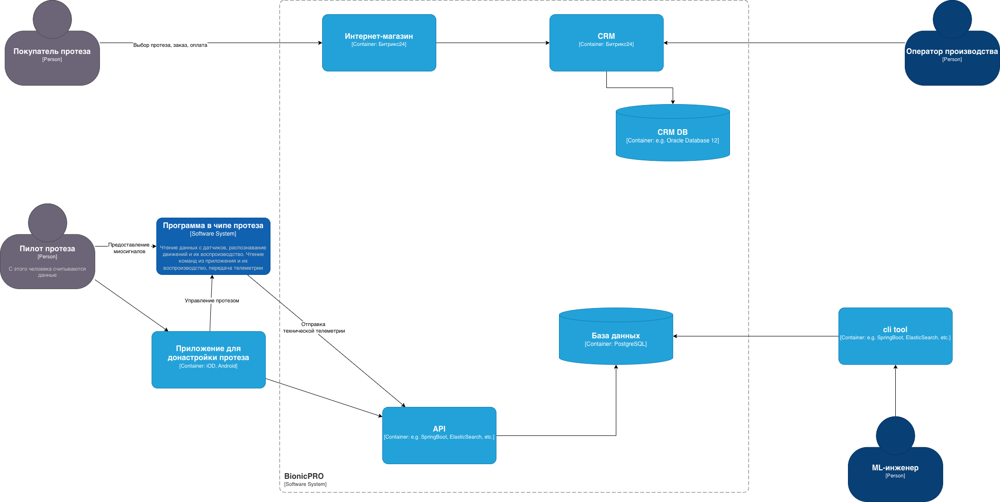
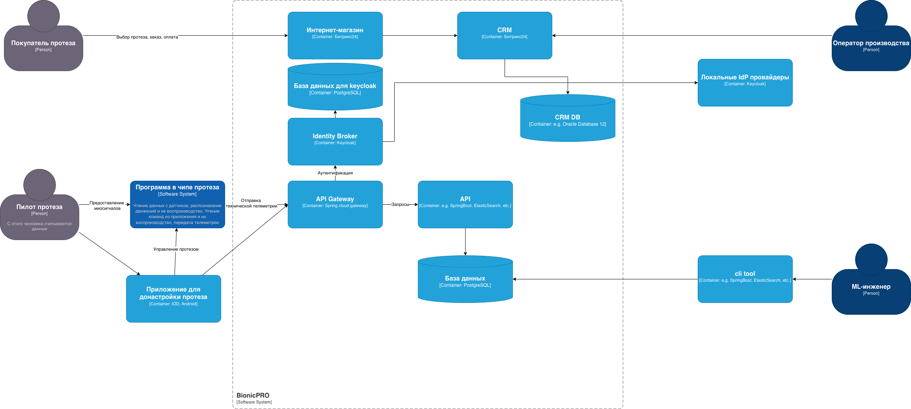
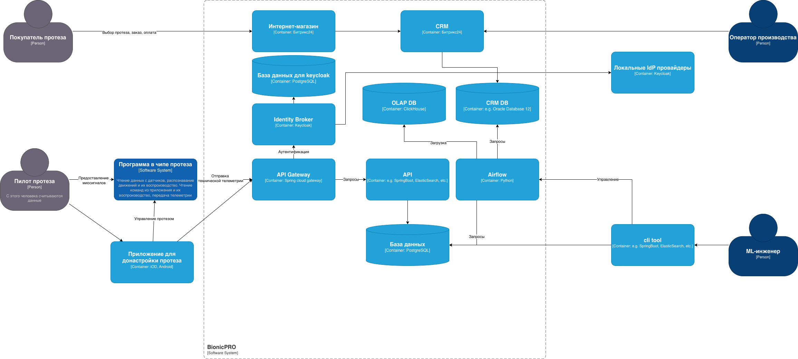
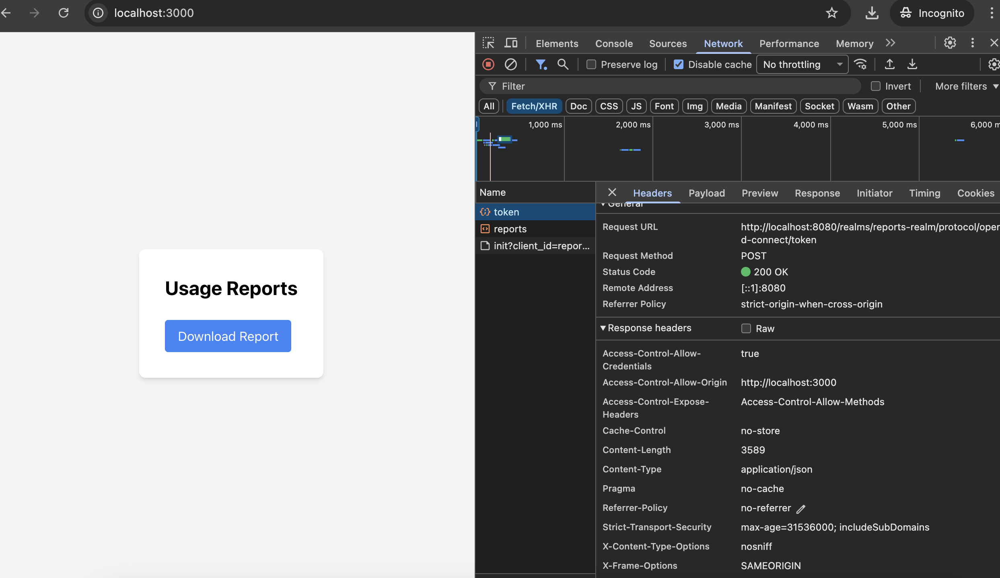
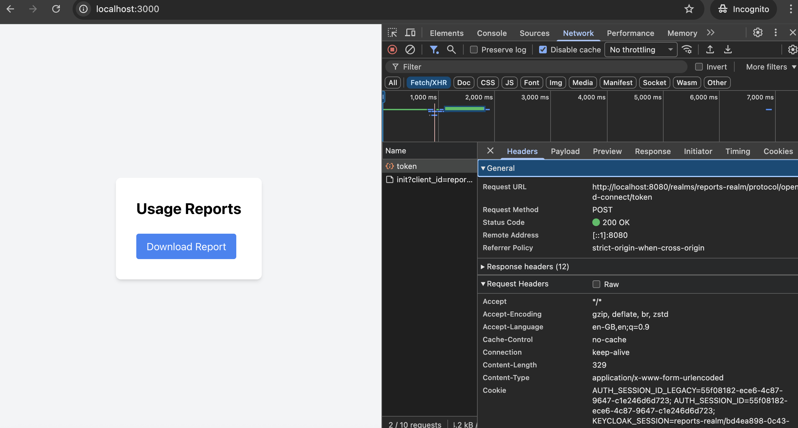
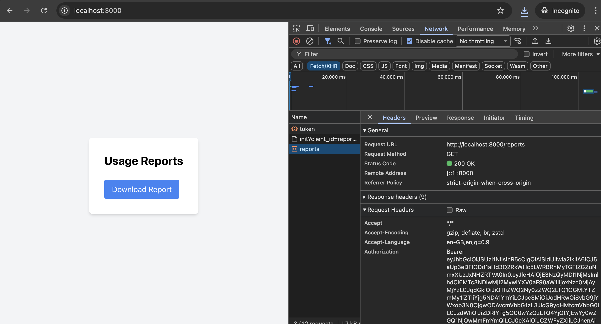

# architecture-bionicpro

## Повышение безопасности системы (задание 1)

Текущее состояние.



[BionicPRO_C4_model_as_is.drawio.xml](docs/BionicPRO_C4_model_as_is.drawio.xml)

Решение должно обеспечивать следующие аспекты (задача 1).

| **№** | **Требование**                                                                                                                                                                                                                                                                  | **Предлагаемое решение**                                                                                                                   |
|:-----:|:--------------------------------------------------------------------------------------------------------------------------------------------------------------------------------------------------------------------------------------------------------------------------------|--------------------------------------------------------------------------------------------------------------------------------------------|
|   1   | Унификацию доступа в системе BionicPRO. Это будет осуществляться через запрос данных учётных записей из внешнего источника, который расположен в стране представительства компании. Принципы локального хранения персональной и медицинской информации не должны быть нарушены. | Необходимо использовать Keycloak как Identity Broker. Взаимодействие должно происходить через API-Gateway.                                 |
|   2   | Безопасную схему работы с access- и refresh-токенами, которая исключает передачу фронтенду токенов, которые были получены от IdP.                                                                                                                                               | Предлагается использовать Reference Tokens в Keycloak.                                                                                     |
|   3   | Возможность поддержки аутентификации пользователей через различные внешние удостоверяющие службы, действующие в разных странах.                                                                                                                                                 | Необходимо использовать Identity Federation. Для каждой страны подключается IdP, которые соблюдают требования локального законодательства. |

Решение с повышением безопасности системы.



[BionicPRO_C4_model_to_be_s.drawio.xml](docs/BionicPRO_C4_model_to_be_s.drawio.xml)

Необходимо изменить Code Grant на PKCE (задача 2).

Что было изменено:

Keycloak ([realm-export.json](keycloak/realm-export.json)):

```
"clients": [
      {
        "clientId": "reports-frontend",
        "directAccessGrantsEnabled": false,
        "standardFlowEnabled": true,
        "attributes": {
          "pkce.code.challenge.method": "S256"
        }
      }
  ]    
```

Frontend ([App.tsx](frontend/src/App.tsx)):

```
const initOptions = {
  onLoad: 'check-sso',
  flow: 'standard',
  pkceMethod: 'S256',
  silentCheckSsoRedirectUri: `${window.location.origin}/silent-check-sso.html`,
};

<ReactKeycloakProvider authClient={keycloak} initOptions={initOptions}>
```

Ссылки:

* https://www.keycloak.org/docs/latest/server_admin/index.html#device-authorization-grant
* https://dev.to/saltorgil/react-keycloak-integration-secure-auth-for-existing-backend-182b
* https://habr.com/ru/articles/927286/
* https://auth0.com/docs/get-started/authentication-and-authorization-flow/authorization-code-flow-with-pkce
* https://www.stefaanlippens.net/oauth-code-flow-pkce.html
* https://auth0.com/docs/get-started/authentication-and-authorization-flow/authorization-code-flow-with-pkce/call-your-api-using-the-authorization-code-flow-with-pkce

## Разработка сервиса отчётов (задание 2)

Архитектура решения для подготовки и получения отчётов (задача 1).



[BionicPRO_C4_model_to_be_r.drawio.xml](docs/BionicPRO_C4_model_to_be_r.drawio.xml)

* Решение использует Apache Airflow для извлечения данных из БД CRM и БД с данными от устройств. 
* Данные сохраняются в структурированном виде в витрину для отчетов OLAP БД Clickhouse. 
* Отчет строится на основе данных из витрины.

В реализации БД CRM и телеметрии используются мок-данные. Для демонстрации.

Airflow DAG (задача 2).

* [airflow](airflow/Dockerfile)
* [bp_etl_reports_tag.py](airflow/dags/bp_etl_reports_tag.py)

Airflow развернут в standalone режиме. Для демонстрации.

Используется таблица для отчета в ClickHouse.

```
CREATE TABLE IF NOT EXISTS reports_mart (
    user_id String,
    username String,
    email String,
    first_name String,
    last_name String,
    prosthetic_model String,
    report_date DateTime,
    thing_id String,
    thing_param_name String,
    thing_value String,
    processed_at DateTime DEFAULT now()
) ENGINE = MergeTree()
ORDER BY (user_id, report_date, thing_id, thing_param_name, processed_at)
```

Колонки.

* user_id. Идентификатор пользователя.
* username. Имя пользователя.
* email. Почта пользователя.
* first_name. Имя.
* last_name. Фамилия.
* prosthetic_model. Модель.
* report_date. Дата отчета.
* thing_id. Идентификатор устройства/протеза.
* thing_param_name. Название параметра устройства.
* thing_value. Значение параметра.
* processed_at. Дата и время фиксации параметра.

Узлы DAG.

* prepare_task. Подготовка процесса.
* extract_crm_data_task. Извлечение данных из БД CRM.
* extract_extract_telemetry_data_task. Извлечение данных из БД телеметрии.
* transform_load_task. Загрузка данных в OLAP (ClickHouse).
* validate_task. Проверка результатов процесса.

```
prepare_task >> [extract_crm_data_task, extract_extract_telemetry_data_task]
[extract_crm_data_task, extract_extract_telemetry_data_task] >> transform_load_task >> validate_task
```

Бэкенд-часть приложения для API (задача 3).

* [backend](backend/Dockerfile)
* [main.py](backend/main.py)

В сервисе реализован rest-метод reports, который возвращает подготовленный отчёт по заданному пользователю.

Ограничение доступа к эндпоинту (задача 4).

Сервис обращается к Keycloak, используя переданный токен из front, и из полученных данных 
извлекает информацию о пользователе. Идентификатор, имя и пр. (user_name используется для демонстрации)
Из этих данных формируются запрос в ClickHouse. Извлекаются данные для отчета и возвращаются в виде файла csv.

В front реализован механизм вызова rest-метода reports (задача 5).

См. [ReportPage.tsx](frontend/src/components/ReportPage.tsx)

### Как запустить?

```
docker compose up
```

```
docker compose up -d
```

### Сервисы

#### frontend. Web-приложение
Адрес: http://localhost:3000

#### keycloak. Auth-сервис
Адрес: http://localhost:8080

#### clickhouse
Адрес: http://localhost:8123/

#### airflow
http://localhost:8081/

### Результаты запуска задачи обработки данных

Пример.


```
Log message source details sources=["/home/airflow/airflow/logs/dag_id=bp_etl_reports/run_id=scheduled__2026-03-19T21:56:14.881722+00:00/task_id=transform_and_load/attempt=1.log"]
[2026-03-20 00:57:03] INFO - DAG bundles loaded: dags-folder source=airflow.dag_processing.bundles.manager.DagBundlesManager loc=manager.py:179
[2026-03-20 00:57:03] INFO - Filling up the DagBag from /home/airflow/airflow/dags/bp_etl_reports_tag.py source=airflow.models.dagbag.DagBag loc=dagbag.py:593
[2026-03-20 00:57:05] WARNING - The `airflow.operators.python.PythonOperator` attribute is deprecated. Please use `'airflow.providers.standard.operators.python.PythonOperator'`. category=DeprecatedImportWarning source=py.warnings loc=/home/airflow/airflow/dags/bp_etl_reports_tag.py:4
[2026-03-20 00:57:05] WARNING - The `airflow.operators.bash.BashOperator` attribute is deprecated. Please use `'airflow.providers.standard.operators.bash.BashOperator'`. category=DeprecatedImportWarning source=py.warnings loc=/home/airflow/airflow/dags/bp_etl_reports_tag.py:5
[2026-03-20 00:57:06] INFO - ch_execute_insert. table=reports_mart, data=[['prothetic1', 'prothetic1', 'prothetic1@example.com', 'Prothetic', 'One', 'bp_v2', datetime.datetime(2026, 3, 19, 21, 57, 6, 129791), '1_1', 'usage_hours', '8.1']], column_names=['user_id', 'username', 'email', 'first_name', 'last_name', 'prosthetic_model', 'report_date', 'thing_id', 'thing_param_name', 'thing_value'] source=unusual_prefix_e0416734ae102d1b218ecaab0c431b1013853431_bp_etl_reports_tag loc=bp_etl_reports_tag.py:38
[2026-03-20 00:57:06] INFO - ch_execute_insert. done source=unusual_prefix_e0416734ae102d1b218ecaab0c431b1013853431_bp_etl_reports_tag loc=bp_etl_reports_tag.py:41
[2026-03-20 00:57:06] INFO - ch_execute_insert. table=reports_mart, data=[['prothetic2', 'prothetic2', 'prothetic2@example.com', 'Prothetic', 'Two', 'bp_v1', datetime.datetime(2026, 3, 19, 21, 57, 6, 129791), '2_1', 'usage_hours', '3.1']], column_names=['user_id', 'username', 'email', 'first_name', 'last_name', 'prosthetic_model', 'report_date', 'thing_id', 'thing_param_name', 'thing_value'] source=unusual_prefix_e0416734ae102d1b218ecaab0c431b1013853431_bp_etl_reports_tag loc=bp_etl_reports_tag.py:38
[2026-03-20 00:57:06] INFO - ch_execute_insert. done source=unusual_prefix_e0416734ae102d1b218ecaab0c431b1013853431_bp_etl_reports_tag loc=bp_etl_reports_tag.py:41
[2026-03-20 00:57:06] INFO - ch_execute_insert. table=reports_mart, data=[['prothetic3', 'prothetic3', 'prothetic3@example.com', 'Prothetic', 'Three', 'bp_v3', datetime.datetime(2026, 3, 19, 21, 57, 6, 129791), '3_1', 'usage_hours', '7.1']], column_names=['user_id', 'username', 'email', 'first_name', 'last_name', 'prosthetic_model', 'report_date', 'thing_id', 'thing_param_name', 'thing_value'] source=unusual_prefix_e0416734ae102d1b218ecaab0c431b1013853431_bp_etl_reports_tag loc=bp_etl_reports_tag.py:38
[2026-03-20 00:57:06] INFO - ch_execute_insert. done source=unusual_prefix_e0416734ae102d1b218ecaab0c431b1013853431_bp_etl_reports_tag loc=bp_etl_reports_tag.py:41
[2026-03-20 00:57:06] INFO - transform_and_load. done source=unusual_prefix_e0416734ae102d1b218ecaab0c431b1013853431_bp_etl_reports_tag loc=bp_etl_reports_tag.py:133
[2026-03-20 00:57:06] INFO - Done. Returned value was: None source=airflow.task.operators.airflow.providers.standard.operators.python.PythonOperator loc=python.py:218
```

### Как проверить, что данные есть в clickhouse после обработки?

```
curl -X POST -F 'query= SELECT username, thing_id, processed_at FROM reports_mart WHERE username = {n:String} ORDER BY processed_at DESC LIMIT 10' -F "param_n=prothetic1" 'http://localhost:8123/?user=admin&password=admin&database=default'
```

Пример ответа:

```
prothetic1      1_1     2026-03-19 22:00:27
prothetic1      1_1     2026-03-19 21:58:23
prothetic1      1_1     2026-03-19 21:57:06
```

```
curl 'http://localhost:8123/?user=admin&password=admin&database=default' \
--data-binary 'SELECT * FROM reports_mart ORDER BY processed_at DESC LIMIT 20'
```

Пример ответа:

```
prothetic3      prothetic3      prothetic3@example.com  Prothetic       Three   bp_v3   2026-03-19 22:00:27     3_1     usage_hours     7.1     2026-03-19 22:00:27
prothetic2      prothetic2      prothetic2@example.com  Prothetic       Two     bp_v1   2026-03-19 22:00:27     2_1     usage_hours     3.1     2026-03-19 22:00:27
prothetic1      prothetic1      prothetic1@example.com  Prothetic       One     bp_v2   2026-03-19 22:00:27     1_1     usage_hours     8.1     2026-03-19 22:00:27
prothetic1      prothetic1      prothetic1@example.com  Prothetic       One     bp_v2   2026-03-19 21:58:22     1_1     usage_hours     8.1     2026-03-19 21:58:23
prothetic2      prothetic2      prothetic2@example.com  Prothetic       Two     bp_v1   2026-03-19 21:58:22     2_1     usage_hours     3.1     2026-03-19 21:58:23
prothetic3      prothetic3      prothetic3@example.com  Prothetic       Three   bp_v3   2026-03-19 21:58:22     3_1     usage_hours     7.1     2026-03-19 21:58:23
prothetic1      prothetic1      prothetic1@example.com  Prothetic       One     bp_v2   2026-03-19 21:57:06     1_1     usage_hours     8.1     2026-03-19 21:57:06
prothetic2      prothetic2      prothetic2@example.com  Prothetic       Two     bp_v1   2026-03-19 21:57:06     2_1     usage_hours     3.1     2026-03-19 21:57:06
prothetic3      prothetic3      prothetic3@example.com  Prothetic       Three   bp_v3   2026-03-19 21:57:06     3_1     usage_hours     7.1     2026-03-19 21:57:06

```

### Результаты запуска получения отчета

Примеры.



[reports.csv](docs/data/reports.csv)

```
frontend-1          | 192.168.65.1 - - [19/Mar/2026:21:57:17 +0000] "GET /favicon.ico HTTP/1.1" 200 226 "http://localhost:3000/" "Mozilla/5.0 (Macintosh; Intel Mac OS X 10_15_7) AppleWebKit/537.36 (KHTML, like Gecko) Chrome/146.0.0.0 Safari/537.36" "-"
frontend-1          | 192.168.65.1 - - [19/Mar/2026:21:57:17 +0000] "GET /favicon.ico HTTP/1.1" 200 226 "http://localhost:3000/" "Mozilla/5.0 (Macintosh; Intel Mac OS X 10_15_7) AppleWebKit/537.36 (KHTML, like Gecko) Chrome/146.0.0.0 Safari/537.36" "-"
backend             | INFO:     192.168.65.1:37781 - "OPTIONS /reports HTTP/1.1" 200 OK
backend             | 2026-03-19 21:57:19,100 - INFO - get_jwks. url=http://keycloak:8080/realms/reports-realm/protocol/openid-connect/certs
backend             | 2026-03-19 21:57:19,105 - INFO - get_reports. starting
backend             | 2026-03-19 21:57:19,105 - INFO - get_reports. user_name=prothetic1
backend             | INFO:     192.168.65.1:37781 - "GET /reports HTTP/1.1" 200 OK
```

Пример с другим пользователем.





[reports.2.csv](docs/data/reports.2.csv)

```
airflow-standalone  | dag-processor | 2026-03-22T17:58:57.066770Z [info     ] Not time to refresh bundle dags-folder [airflow.dag_processing.manager.DagFileProcessorManager] loc=manager.py:536
backend             | INFO:     192.168.65.1:36776 - "OPTIONS /reports HTTP/1.1" 200 OK
backend             | 2026-03-22 17:59:25,445 - INFO - get_jwks. url=http://keycloak:8080/realms/reports-realm/protocol/openid-connect/certs
backend             | 2026-03-22 17:59:26,700 - INFO - HTTP Request: GET http://keycloak:8080/realms/reports-realm/protocol/openid-connect/certs "HTTP/1.1 200 OK"
backend             | 2026-03-22 17:59:26,934 - INFO - get_reports. starting
backend             | 2026-03-22 17:59:26,935 - INFO - get_reports. user_name=prothetic2
backend             | INFO:     192.168.65.1:36776 - "GET /reports HTTP/1.1" 200 OK
```

## Ресурсы

[README.md](docs/README.md)
