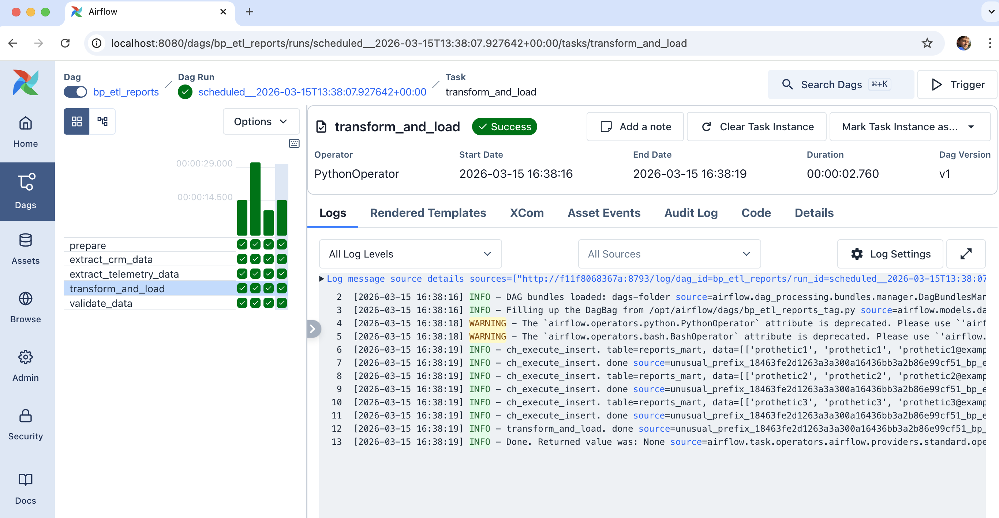
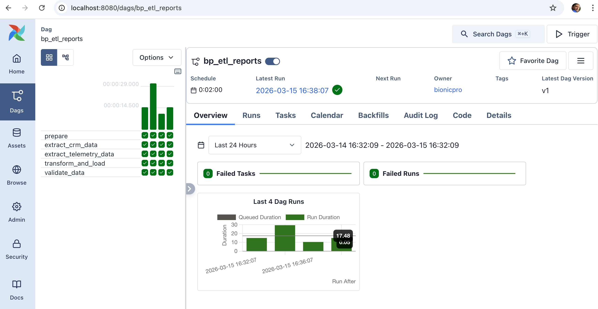

# architecture-bionicpro

## Повышение безопасности системы

## Разработка сервиса отчётов

### Как запустить?

```
docker compose up
```

```
docker compose up -d
```

### Сервисы

#### frontend. Web-приложение
Адрес: http://localhost:3000

#### keycloak. Auth-сервис
Адрес: http://localhost:8080

#### clickhouse
Адрес: http://localhost:8123/

#### airflow
http://localhost:8081/

### Результаты запуска задачи обработки

Пример.



```
Log message source details sources=["http://f11f8068367a:8793/log/dag_id=bp_etl_reports/run_id=scheduled__2026-03-15T13:38:07.927642+00:00/task_id=transform_and_load/attempt=1.log"]
[2026-03-15 16:38:16] INFO - DAG bundles loaded: dags-folder source=airflow.dag_processing.bundles.manager.DagBundlesManager loc=manager.py:179
[2026-03-15 16:38:16] INFO - Filling up the DagBag from /opt/airflow/dags/bp_etl_reports_tag.py source=airflow.models.dagbag.DagBag loc=dagbag.py:593
[2026-03-15 16:38:18] WARNING - The `airflow.operators.python.PythonOperator` attribute is deprecated. Please use `'airflow.providers.standard.operators.python.PythonOperator'`. category=DeprecatedImportWarning source=py.warnings loc=/opt/airflow/dags/bp_etl_reports_tag.py:4
[2026-03-15 16:38:18] WARNING - The `airflow.operators.bash.BashOperator` attribute is deprecated. Please use `'airflow.providers.standard.operators.bash.BashOperator'`. category=DeprecatedImportWarning source=py.warnings loc=/opt/airflow/dags/bp_etl_reports_tag.py:5
[2026-03-15 16:38:19] INFO - ch_execute_insert. table=reports_mart, data=[['prothetic1', 'prothetic1', 'prothetic1@example.com', 'Prothetic', 'One', 'bp_v2', datetime.datetime(2026, 3, 15, 13, 38, 19, 163436), '1_1', 'usage_hours', '8.1']], column_names=['user_id', 'username', 'email', 'first_name', 'last_name', 'prosthetic_model', 'report_date', 'thing_id', 'thing_param_name', 'thing_value'] source=unusual_prefix_18463fe2d1263a3a300a16436bb3a2b86e99cf51_bp_etl_reports_tag loc=bp_etl_reports_tag.py:35
[2026-03-15 16:38:19] INFO - ch_execute_insert. done source=unusual_prefix_18463fe2d1263a3a300a16436bb3a2b86e99cf51_bp_etl_reports_tag loc=bp_etl_reports_tag.py:38
[2026-03-15 16:38:19] INFO - ch_execute_insert. table=reports_mart, data=[['prothetic2', 'prothetic2', 'prothetic2@example.com', 'Prothetic', 'Two', 'bp_v1', datetime.datetime(2026, 3, 15, 13, 38, 19, 163436), '2_1', 'usage_hours', '3.1']], column_names=['user_id', 'username', 'email', 'first_name', 'last_name', 'prosthetic_model', 'report_date', 'thing_id', 'thing_param_name', 'thing_value'] source=unusual_prefix_18463fe2d1263a3a300a16436bb3a2b86e99cf51_bp_etl_reports_tag loc=bp_etl_reports_tag.py:35
[2026-03-15 16:38:19] INFO - ch_execute_insert. done source=unusual_prefix_18463fe2d1263a3a300a16436bb3a2b86e99cf51_bp_etl_reports_tag loc=bp_etl_reports_tag.py:38
[2026-03-15 16:38:19] INFO - ch_execute_insert. table=reports_mart, data=[['prothetic3', 'prothetic3', 'prothetic3@example.com', 'Prothetic', 'Three', 'bp_v3', datetime.datetime(2026, 3, 15, 13, 38, 19, 163436), '3_1', 'usage_hours', '7.1']], column_names=['user_id', 'username', 'email', 'first_name', 'last_name', 'prosthetic_model', 'report_date', 'thing_id', 'thing_param_name', 'thing_value'] source=unusual_prefix_18463fe2d1263a3a300a16436bb3a2b86e99cf51_bp_etl_reports_tag loc=bp_etl_reports_tag.py:35
[2026-03-15 16:38:19] INFO - ch_execute_insert. done source=unusual_prefix_18463fe2d1263a3a300a16436bb3a2b86e99cf51_bp_etl_reports_tag loc=bp_etl_reports_tag.py:38
[2026-03-15 16:38:19] INFO - transform_and_load. done source=unusual_prefix_18463fe2d1263a3a300a16436bb3a2b86e99cf51_bp_etl_reports_tag loc=bp_etl_reports_tag.py:130
[2026-03-15 16:38:19] INFO - Done. Returned value was: None source=airflow.task.operators.airflow.providers.standard.operators.python.PythonOperator loc=python.py:218
```



### Как проверить, что данные есть в clickhouse после обработки?

```
curl 'http://localhost:8123/?user=admin&password=admin&database=default' \
--data-binary 'SELECT * FROM reports_mart LIMIT 10'
```

Пример ответа:
```
prothetic1	prothetic1	prothetic1@example.com	Prothetic	One	bp_v2	2026-03-15 13:32:21_1	usage_hours	8.1	2026-03-15 13:32:25
prothetic1	prothetic1	prothetic1@example.com	Prothetic	One	bp_v2	2026-03-15 13:34:31_1	usage_hours	8.1	2026-03-15 13:34:33
prothetic2	prothetic2	prothetic2@example.com	Prothetic	Two	bp_v1	2026-03-15 13:32:22_1	usage_hours	3.1	2026-03-15 13:32:25
prothetic2	prothetic2	prothetic2@example.com	Prothetic	Two	bp_v1	2026-03-15 13:34:32_1	usage_hours	3.1	2026-03-15 13:34:33
prothetic3	prothetic3	prothetic3@example.com	Prothetic	Three	bp_v3	2026-03-15 13:32:23_1	usage_hours	7.1	2026-03-15 13:32:25
prothetic3	prothetic3	prothetic3@example.com	Prothetic	Three	bp_v3	2026-03-15 13:34:33_1	usage_hours	7.1	2026-03-15 13:34:33
```

